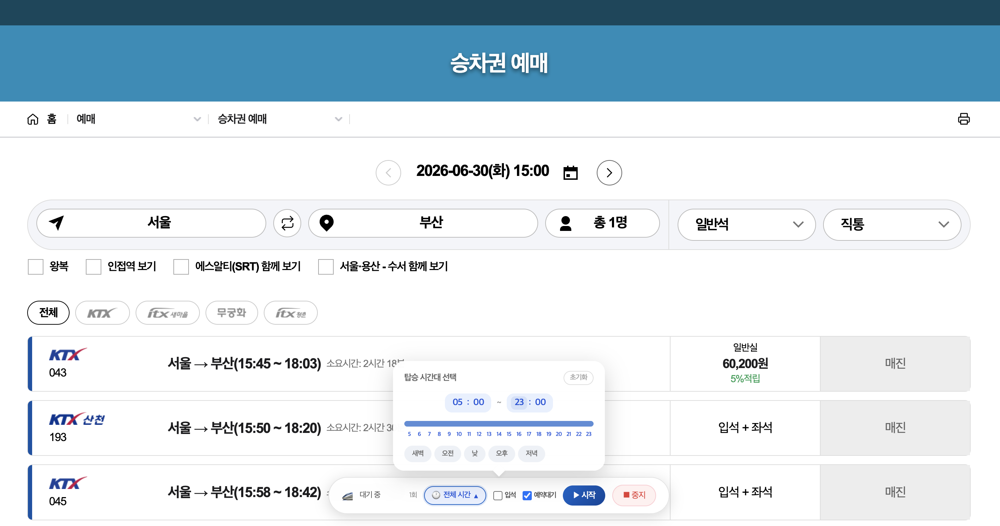
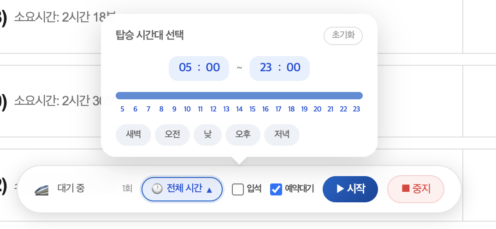
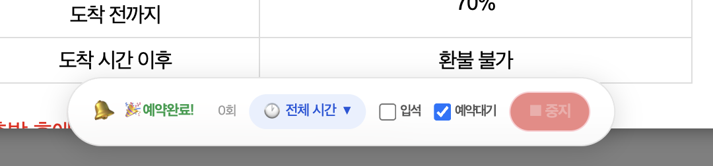
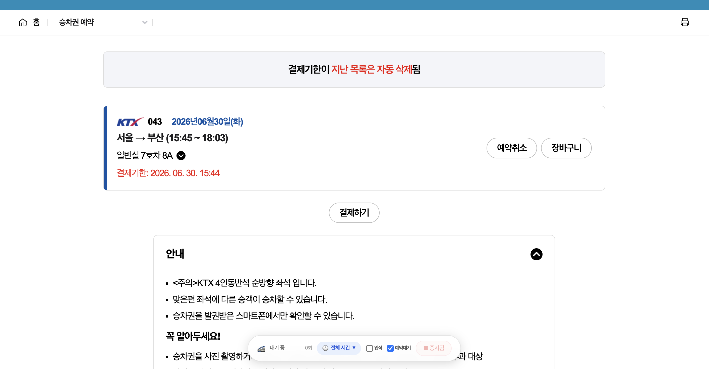

# KTX 자동 예매 도우미

코레일(letskorail.com) KTX 빈자리를 자동으로 감지하고, 좌석 선택부터 예약 확인까지 이어주는 Chrome 확장 프로그램입니다. Manifest V3 기반으로 제작했습니다.

> **개인 학습용 프로젝트입니다.** Chrome Extension MV3 구조, SPA 페이지의 DOM 자동화, MutationObserver 활용을 학습하기 위해 만들었으며 스토어에 배포하지 않았습니다. 코레일 이용약관상 자동화 도구 사용에 제약이 있을 수 있으므로 실사용에 따른 책임은 사용자에게 있습니다.

## 주요 기능

- **빈자리 자동 탐색** — 5초 간격으로 조회 결과를 갱신하며 예매 가능 좌석을 감지
- **전 과정 자동화** — 좌석 감지 → 예매 버튼 클릭 → 확인 팝업 처리 → 예약 완료까지 자동 진행
- **탑승 시간대 필터** — 원하는 시간대의 열차만 대상으로 탐색 (프리셋 지원)
- **입석 / 예약대기 옵션** — 일반석 매진 시 대체 좌석 유형 선택 가능
- **플로팅 퀵바** — 드래그로 위치 조절 가능한 컨트롤 바에서 시작/중지, 시도 횟수, 실시간 로그 확인
- **알람** — 예약 성공 시 Web Audio API 비프음으로 즉시 알림

## 스크린샷

| 예매 화면 + 퀵바 | 시간대 설정 |
|---|---|
|  |  |

| 자동 예약 완료 | 결제 대기 |
|---|---|
|  |  |

## 동작 방식

```
┌──────────────────┐     ┌──────────────────┐
│ Service Worker   │────▶│  Content Script  │
│ (background.js)  │     │  (content.js)    │
│ 탐색 루프·상태·로그 │     │  DOM 감지·클릭    │
└────────┬─────────┘     └────────┬─────────┘
         │                        │
         │ chrome.runtime         │ MutationObserver
         │ .sendMessage           ▼
         │               ┌──────────────────┐
         │               │  코레일 예매 페이지 │
         │               │  (React DOM)     │
         │               └──────────────────┘
         ▼
┌──────────────────┐
│  Popup / 퀵바 UI  │
│  설정·로그·컨트롤   │
└──────────────────┘
```

- **Service Worker**(`background.js`)가 탐색 루프와 실행 상태, 로그를 관리하고 코레일 탭에 명령을 보냅니다.
- **Content Script**(`content.js`)가 조회 결과 테이블에서 예매 가능 좌석을 감지하고, 좌석 유형·시간대 조건에 맞으면 예매 버튼 클릭 → 확인 팝업 처리를 수행합니다. 동적으로 뜨는 팝업은 MutationObserver로 실시간 감지합니다.
- 코레일 예매 페이지는 React 기반 SPA라서, 렌더링된 DOM의 이벤트 핸들러를 직접 호출하는 방식으로 상호작용합니다. DOM 구조 분석 내용은 [KORAIL_DOM.md](KORAIL_DOM.md)에 정리했습니다.

## 설치 (개발자 모드)

1. 이 저장소를 클론하거나 ZIP으로 다운로드합니다.
2. Chrome에서 `chrome://extensions` 접속 → 우측 상단 **개발자 모드** 활성화.
3. **압축해제된 확장 프로그램을 로드합니다** 클릭 → 이 폴더 선택.
4. 코레일 승차권 조회 페이지에서 하단에 퀵바가 나타나면 설치 완료입니다.

## 파일 구성

| 파일 | 역할 |
|---|---|
| `manifest.json` | MV3 매니페스트 (permissions, content script 매칭) |
| `background.js` | Service Worker — 탐색 루프, 상태 관리, 로그 |
| `content.js` | 코레일 페이지 주입 스크립트 — 좌석 감지, 자동 클릭, 퀵바 UI |
| `popup.html` / `popup.js` | 확장 아이콘 팝업 — 설정 UI |
| `KORAIL_DOM.md` | 코레일 예매 페이지 DOM 구조 분석 노트 |

## 기술 스택

`Chrome Extension Manifest V3` · `Vanilla JavaScript` · `MutationObserver` · `Web Audio API` · `chrome.storage / chrome.alarms`
